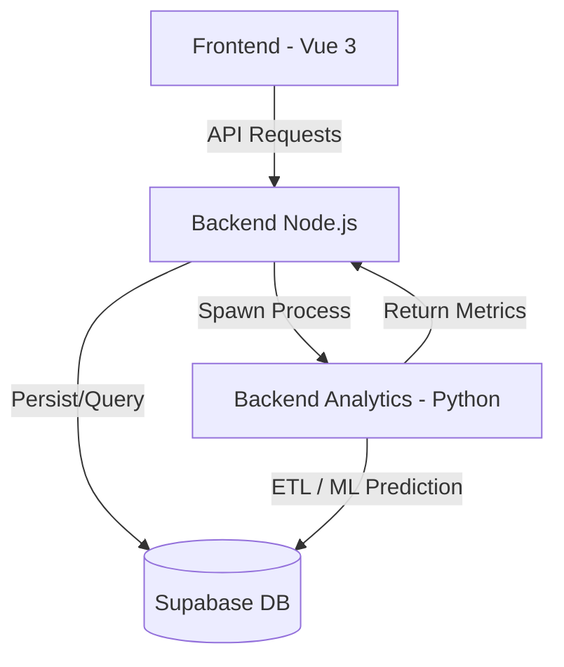

# Restaurant Analytics & Sentiment Platform

[](https://blog.cleancoder.com/uncle-bob/2012/08/13/the-clean-architecture.html)
[](/backend-node)
[](/backend-analytics)
[](/frontend)

A state-of-the-art full-stack platform designed to analyze restaurant performance through customer reviews. The system leverages **Clean Architecture**, **Machine Learning**, and **Feature-Sliced Design** to deliver deep insights into gastronomic experiences.

---

## 🏗️ System Architecture

The platform follows a distributed architecture with specialized services:



### Key Modules
1.  **[frontend](/frontend)**: User interface built with Vue 3 and Feature-Sliced Design (FSD).
2.  **[backend-node](/backend-node)**: Main API handling business logic, authentication (RBAC), and storage.
3.  **[backend-analytics](/backend-analytics)**: Data science engine for Sentiment Analysis and IGE (Index of Gastronomic Experience) calculations.

---

## 🚀 Technology Stack

### Core
- **Database**: Supabase (PostgreSQL)
- **Design Pattern**: Domain-Driven Design (DDD) & Clean Architecture

### Backend (Node)
- **Runtime**: Node.js v20+ with TypeScript
- **Framework**: Express 5 (Native Async Error Handling)
- **ORM**: Prisma v7
- **Security**: JWT + Argon2 Hashing

### Analytics (Python)
- **Intelligence**: Scikit-Learn (Logistic Regression + TF-IDF)
- **Processing**: Pandas & Numpy
- **Persistence**: SQLAlchemy 2.0

### Frontend
- **Framework**: Vue 3 (Composition API)
- **Build Tool**: Vite
- **Architecture**: Feature-Sliced Design (FSD)

---

## 🛠️ Quick Start

### Prerequisites
- Node.js (v20+)
- Python (3.12+)
- A Supabase/PostgreSQL instance

### 1. Database Setup
Ensure your PostgreSQL instance is running. Execute the schema found in `backend-node/database/sql/schema.sql` if manual initialization is needed.

### 2. Backend Node Setup
```bash
cd backend-node
cp .env.example .env  # Update with your DB credentials
npm install
npm run prisma:push   # Sync database schema (see note below)
npm run dev
```

> **Note:** If `prisma db push` hangs (common with Supabase pooler), run the schema changes directly in Supabase Dashboard → SQL Editor, then run `npx prisma generate` locally.

### 3. Backend Analytics Setup
```bash
cd backend-analytics
cp .env.example .env  # Update with your DB credentials
python -m venv venv
# Windows:
.\venv\Scripts\activate 
# Linux/Mac:
source venv/bin/activate
pip install -r requirements.txt
```

### 4. Frontend Setup
```bash
cd frontend
npm install
npm run dev
```

---

## 📈 Key Metrics
The system calculates the **Index of Gastronomic Experience (IGE)** using a weighted formula:
- **Food Quality**: 50%
- **Service Quality**: 30%
- **Pricing Value**: 20%

---

## 🛡️ License
This project is for academic and professional demonstration purposes at Anáhauc Oaxaca University.
